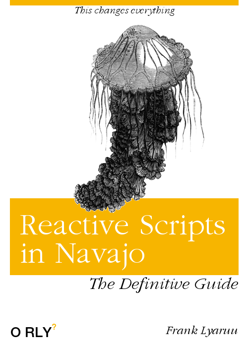

## Reactive Scripts in Navajo

Over the last period of time I have built a reactive version of Navajo scripts. It is by no means complete, but I do think it starts to be useful to get some input, and real use cases are more and more frequent.

It is not supposed to replace navascript (or scala for that matter), it's just another tool to address certain problems.

The primary reason for reactive scripts was performance: A reactive script can often do the same thing with less resources, but over time I have grown fond of the functional style of programming.

#### Reactive Streams

The reactive Navajo scripts are based on reactive streams API's.
Reactive streams is a project (originally ported from dotnet) to make working with non-blocking data sources a bit easier.

The fundamental difference between a script and a stream is that a script is a series of instructions that we follow sequentially:

A script would do for example (very much pseudo code):
$> Query database
 $> For each row: - add output row to response
\$> write response to client

I assume this is pretty familiar: It will move through these 'instructions' sequentially, and loop over every row.

A (reactive) stream would do something like this:

\$> Query database | transform row to output row | write to client

(if you understand my unix pipe '|' usage)

This will build the pipeline, and activate it. The pipeline will run until 1) the source (the database) has no more data to give and completes, or 2) the sink (the client) indicates that it is no longer interested in data.
There is no notion of sequential instructions, but there is a notion of sequential processors on an 'assembly line'

It seems similar, but it does require a change in thinking. Some things you can easily do in a script but not in a reactive stream, and some things that are impossible in a script are easy in a stream.

Decent intro to reactive streams in Java, it's worth a read:
https://dzone.com/articles/what-are-reactive-streams-in-java

### Why?

#### Memory usage

If I query a large result set in NavaScript, the whole thing must fit in memory, and then the response document also gets created in memory. This strains the application servers in itself (a sizeable part of the memory usage is request and response Navajo objects), and it limits the size of the result set.

Right now we limit the number of elements in a Navajo array to 10000, just to avoid blowing up an app server because of an enthusiastic query.
If we want bigger result sets, we need to do work arounds (like querying straight into a binary or something), and that greatly complicates further processing.

So for example, if I query 10000 rows from some data source, it will create 10000 record objects, then create 10000 array message elements, and only when the whole script is done it will start streaming the data to the client.

This is inefficient, as in most cases we could save time by starting to stream data to the client much earlier, and save memory by not putting the entire result set in memory at the same time.

If we want to do this, we do have to make some sacrifices:

- In regular Navajo, we can change anything we want in the response for as long as the script runs. If we stream data to the client, we can only change it until we've streamed it to the client.

- Error handling can be harder. If we encounter an error while running, we can't easily 'throw' and exception and return a HTTP 500 error or something, as we are already streaming results. We can't totally hide this effect for clients, so we do need to be careful if we rewrite a script as being reactive. It might start streaming a response, encounter an error and abort half way through. The client should be aware of that and make a decision on how to deal with this situation.

#### Thread usage

We block a lot of threads now. Every time we run a script, whenever we need to wait for network traffic to a client, a database or basically anything external, that thread is blocked. It still consumes quite a bit of memory and CPU. With all the power of modern servers, each server still can have only a few hundred threads.

#### Cancellation

In classic blocking code it is really difficult to cancel something. Take the following example:

- We call a service
- The service queries a database, and starts retrieving a (big) data set
- .. but the client drops its connection for whatever reason

In our 'classic' situation, our script will continue doing everything and crash when trying to write the result set back to the client. There is simply no way to tell the database to stop querying while it is blocking in a method.

Reactive scripts can propagate the 'cancel' to the source. In this case, when the connection is dropped, it can inform the database that it can stop retrieving data: The 'upstream' path and the 'downstream' path are independent.

A reactive 'conversation' would go something like this

- (up) I'd like to query this data and subscribe the result
- (down) Ok, ready when you are
- (up) I'm ready to receive n messages of data
- (down) (Gives some messages)
- (down) (Gives some messages)
- (down) (Gives some messages) (In total not more than n)
- (up) I'm ready to receive n (more) messages of data
- (down) (Gives some messages)
- (down) That's all, bye!

Or, the client can cancel:

- (up) I'd like to query this data and subscribe the result
- (down) Ok, ready when you are
- (up) Give n messages of data
- (down) (Gives some messages)
- (up) I've got all I want, nevermind more data
- (down) Ok bye

Again, when everything is running smooth this seems an academic edge case, but when the load is high and networks get saturated a reactive application degrades much more gracefully.

#### Parallel execution

In normal threaded code, it is pretty hard to spread an operation to run on multiple cores at the same time: Race conditions and subtle threading bugs are a risk, and if you get anything wrong it might hurt performance a lot or even crash the entire JVM.

For reactive streams it is easier, as we don't define sequential order to instructions, but the order of transformations that need to be applied to a message.

### Examples

I made a pretty hands-on set of examples here:

[[Reactive-Examples]]

#### Other type of sources

At this time, the following sources exist:

- sql: A query to a sql database. Now we use rxjdbc, which is a reactive wrapper around the (blocking) JDBC
- mongo: A query to a mongo database
- single: One or more empty messages
- input: A stream of input. (Will be addressed later)
- topicsubscriber: A subscription to a kafka topic
- callSource: Call a regular navajo script, returns a eventstream

I'd like to explain the single source, as we'll be using it often in examples. It takes an optional 'count' (by default 1) parameter that indicates how many items it will emit. It will emit empty messages. I'll get back to the 'single' source after I've introduced transformers.

### Type

All sources have a type. This is a different kind of type than the regular 'string, integer etc.' type. This types are a bit more on macro level.

The most common one --at this time all sources emit those-- is:

##### Msg

The most common one, all sources (for now) emit those. A message source is a source of 0 or more immutable messages (Instances of the ImmutableMessage class). Like a JSON object, each message can have named properties of all the types known to Navajo (except binaries), named sub-messages, and named lists of submessages.

##### Singlemessage

One single message. Not zero, not more than one. Matters for some of the transformers, we will use it in the reducer. For the rest, it is the same as a Msg

##### Event

A stream of message events. An event is a streamed version of a message. The best way to look at this as xml tags. For example a message has a start event and an end event.
A message with a submessage will have the following events:

- [messagestart name=outer]
- [messagestart name=inner]
- [messageend]
- [messageend]

There are other events, these are the types:

```java
public enum NavajoEventTypes {
	MESSAGE_STARTED,
	MESSAGE,
	ARRAY_STARTED,
	ARRAY_ELEMENT,
	ARRAY_DONE,
	NAVAJO_DONE,
	NAVAJO_STARTED,
	ARRAY_ELEMENT_STARTED,
	MESSAGE_DEFINITION_STARTED,
	MESSAGE_DEFINITION,
	BINARY_STARTED,
	BINARY_CONTENT,
	BINARY_DONE
}
```

With those we can reproduce any Navajo object. (Note that properties and selections are contained in MESSAGE or ARRAY_ELEMENT, and any header elements are contained in NAVAJO_STARTED. Methods are contained in NAVAJO_DONE

It is important to realize that ordering is crucial.

If you're just using reactive scripts, you don't really need to think about this stream type, aside from the 'tml' transformer, pretty much all relevant sources and transformers only deal with messages.

#### Eventstream

A stream of event streams. A bit meta, but if I call a service (reactive or not) I get back a stream of events. The 'msg.call.eventstream' transformer returns these, I'll get to that later.

#### Data

A piece of binary data, without any wrapping or context, modeled by a byte array.

### Transformers

Let's get back to our example:

```
mongo(resource='mongoreplicate',collection='Club',operation='find',query='{}')
	->deleteAll(name='Dispensation')
	->tml(messageName='Club',isArray=true)
```

The tag `tml(messageName='Club',isArray=true)` is a transformation. Transformations change the stream in some way. In this case, it transforms the message stream from mongodb (with the 'json style' messages), and transforms it into 'TML style' events.

Transformers take parameters in exactly the same way as sources, so by using attributes (optionally ending with ':' if they need to be evaluated as an expression, or by param / param.eval sub tags)
The 'stream' transformer only works on 'Msg' style streams, and will always return an event type stream. If the types mismatch, the stream will generate a compilation error before starting.

For the stream transformer you need to supply a name for the message and whether it is an array message or not. Again, the typing is strong, so if a required parameter is missing, a parameter type is wrong, or an unsupported parameter is supplied, the compiler will throw an error before starting.

Let's do a few simple examples:

```
single()
	->tml(messageName='Result', isArray=false)
```

This creates _one_ empty message, and returns it as a single message (not an array) named 'Result':

```xml
<tml>
   <header>
      <transaction rpc_name="reduce/single" rpc_usr=""/>
      <callback/>
      <client/>
   </header>
   <message name="Result">
   </message>
</tml>
```

Let's make _two_ (empty) messages, and return an array:

```
single(count=2)
	->tml(messageName='Result', isArray=true)
```

(If we stream two messages, but we transform it into a non-array message, it will only show the first)

Result:

```xml
<tml>
   <message name="Result" type="array">
      <message name="Result" index="0" type="array_element">
      </message>
      <message name="Result" index="1" type="array_element">
      </message>
   </message>
</tml>
```

Let's add something into the messages:

```
single()
	->set(SomeString='Monkey', AnInteger=1+1 AnUpperCaseString=ToUpper('uppercase'))
	->tml(messageName='Result', isArray=false)
```

The result is:

```xml
<tml>
   <header>
      <transaction rpc_name="reduce/single" rpc_usr=""/>
      <callback/>
      <client/>
   </header>
   <message name="Result">
      <property name="AnUpperCaseString" type="string" value="UPPERCASE"/>
      <property name="AnInteger" type="integer" value="2"/>
      <property name="SomeString" type="string" value="Monkey"/>
   </message>
</tml>
```

#### Performance

The script that queried mongodb before is an example of what you can do with a reactive script. You could code this in a regular script without any problem, but the server will simply run out of memory (at least for a large union). It essentially downloads the entire club collection from MongoDb into memory and transforms it to XML.

We could run this using curl:

```bash
frank@MacBook-Frank-2:~$ curl -H "X-Navajo-Service:mongobasic" -H "X-Navajo-username:username" -H "X-Navajo-password:password" localhost:9090/stream/KNVB >output
  % Total    % Received % Xferd  Average Speed   Time    Time     Time  Current
                                 Dload  Upload   Total   Spent    Left  Speed
100  120M    0  120M    0     0  7168k      0 --:--:--  0:00:17 --:--:-- 8186k
```

This basically downloads the entire club collection from the KNVB, and returns 120M of XML data. This is something you can not do with a regular script, it would completely cripple the application server, but the reactive script runs fine and spits out the data in a few seconds. You could also try to run this script form the tester.js in Navajo, but that will simply make your browser run out of memory.

This is nice as a demo, but nobody wants a 120M XML file, lets add another transformer:

```
mongo(resource='mongoreplicate',collection='Club',operation='find',query='{}')
	->take(10)
	->tml(messageName='Club',isArray=true)
```

I've added the 'take' transformer. The take transformer will accept the supplied number of items, and then signal the source that it should stop emitting, so this transformer will emit the first 10 documents from this query.

The take transformer takes one unnamed parameter, an integer, and you can configure transformers exactly the same way as sources.

Again the name 'take' means that the take operator takes messages and emits messages.

Remember that it does not query everything and throws away everything beyond the first 10, it will actively cancel the source. If the source will respect that or not depends on the implementation of the source though. If you build a naïve source that just keeps on emitting the'take' transformer will discard them, but you might waste a lot of resources.

Generally though, this should be pretty efficient, nearly as efficient as propagating the 'take' to the database, in this case by using 'limit' in mongodb.

I've implemented some transformers that seemed useful to me, and I try to use the same names as the ones defined in the Reactive Streams library [[http://reactivex.io/documentation/operators/take.html]]. Browsing this documentation is useful getting used to the concepts and language.

#### Methods

In navascript we have a notion of methods: A list of sort of hyperlinks to other scripts that we suggest could be run with the output of this script as input.

As far as I know, we only use it in the tester, but it really does help to debug, so I added it to the reactive language as well.

It looks something like this:

```
=>(methods='tutorial/searchorganization')
single()
	->set(Name='')
	->tml(messageName='OrganizationSearch', isArray=false)
```

The header =>(...) allows you to provide some special headers to a script, and in this case we use the 'methods' attribute, that is a comma separated string.

#### Mappers

Let's introduce another class of operator: the mapper.

```
mongo(resource='mongoreplicate',collection='Club',operation='find',query='{}')
	->take(10)
	->deleteAll(name='Dispensation')
	->tml(messageName='Club',isArray=true)
```

I've added the 'deleteAll' mapper. A mapper is like a transformer, but only affects one message at the time, and it will always take a message and returns a message.

The 'deleteAll' mapper deletes a sub message from each message that passes through.

Mappers are pretty easy to make (essentially a message->message function) and I haven't put in a lot of effort to make them complete or intuitive. Right now there following exist:
set,setkv,store,delete,deleteAll,rename,dump,saveAll,save,store

I'll get back later on the more exotic ones.

Again, you can configure parameters in the same way as sources or transformers

It is important to understand the difference between a mapper and a transformer, as it can be a bit subtle. A transformer affects the stream, a mapper affects the items of a stream.

By extension, a transformer could also affect the messages inside the stream, but a mapper only has a perspective of one message at a time, and every input message results in exactly one output message.

That said, in many situations you can use them interchangeably: In a source you can mix transformers and mappers freely (In reality, the compiler will create a 'single' transformer around every mapper)

Another example, now a different data source, a SQL data source:

```
sql(resource='sportlinkkernel',query='select * from organization where name like ?','Al%')
	->tml(messageName='Organizations', isArray=true)
```

It's pretty much the same. The query language is obviously different, and the collection and operation isn't needed, but for the rest it is completely compatible.

### Binary data

Reactive scripts can also return binary data directly, without encoding it as base64 and wrapping it in XML. It does require the client to be cool with it though, and check the Content-Type of the response before trying to parse it as XML.

```
single(count=6)
	->set(name='Joe'+[@index],BankAccount/balance=[@index])
	->csv(delimiter=',',[name],ToString([BankAccount/balance]))
```

It creates a few messages and create some properties (Joe\* + BankAccount/balance) and uses the 'csv' transformer.
The CSV transformer has output type 'binary', and because it is the last transformer of the source, it means that the effective output type of the source is now binary, and it will simply stream that to the client.

The csv transformer adds some metadata, it will 'tell' the script that the result will have a mime type of text/csv.

#### Reducing

Until now, we've only addressed situations where we handle one message at a time, but sometimes we need to do an operation that spans multiple messages.

The simplest example of this would be to count the number of items from a row. That number isn't depending on one item, it depends on all of them.

A simple example:

```
single(count=15,debug=true)
	->reduce(saveall(sum=0),set(sum=[@sum]+1))
	->tml(messageName='Bla', isArray=false)
```

We start with creating 15 empty messages. We offer all those messages to the 'reduce' transformer. The reduce transformer will not emit anything until the input is completed.

There are two functions in the reducer. The first, the 'seed', will be called once before starting. That will initialize the param message.

The second function gets called with every message offered to the transformer, along with the param message, that the reduce can transform and return a new param message.

Even though all messages here are immutable, this gives us a way to store state.
When the input stream completes, the reducer will return the final version of the param message.

So in this case, we create a summation of the message count. But we can do anything that has this model. Go through a list and find one with the highest value. Aggregate is some other way. All is possible as long as the final result is a single message.

The mappers inside the reducer (in this case 'save') have access to another message, the 'accumulator'. I've mapped it to the 'param message' of Navajo. This accumulator message carries over between the messages, and you can write to them using the 'save' mapper. You can read from it using param expressions ('[@Count]').

Results in this TML:

```xml
<tml>
   <message name="Result">
      <property name="Total" type="integer" value="15"/>
   </message>
</tml>
```

Let's do a bit more hard-core example. Until now, we only had one source, but sometimes we'd like to combine sources. I'll use two SQL sources now, but we can mix and match any kind of data source.

To do that, I'd like to introduce that you can pass new pipelines into transformers (certain transformers at least).

Take a look at this 'join' transformer:

```
single()
	->set(somestring='blob')
	->join(
		    ->single()
			->set(sub='subprop'),
		set(moved=[sub],constant='iamconstant',tryagain=[@somestring]),
		set(someint=3)
	)
	->tml(messageName='Test',isArray=false)
```

We create a single message, give it a property (somestring), and pass it into the join transformer.
The first parameter of a join transformer is another pipeline:

```
->single()
			->set(sub='subprop'),
```

in this case a single message with a poperty called sub.
This sub stream should only deliver one messages, so usually it should end with something like a 'reduce' or a 'first'.

The subsequent parameters are functions on how to combine the two messages (There are two relevant messages in this situation: 1) the message thats passing through the transformer right now.

What do we do here?

- We query the entire Club collection
- We filter only the documents with communityofbusiness = Amsterdam (ok, ok it would make more sense to put that into the query, but you get the point)
- We insert it into another collection: inserttest
- We reduce the stream of 'inserted' messages, to calculate the grand total of all inserted messages.

Note that mongoinsert is pretty smart in the sense that it will buffer the input and use 'bulk insert' to efficiently insert all the documents.

My point is that the mongoinsert is essentially a sink that eats all the messages, and uses its output to give feedback about how it is doing.

### External cancellation

You can kill running reactive scripts much more effectively than blocking scripts. If you want to cancel a running reactive script for whatever reason, if all the sources and transformers behave, that should always be possible.

This opens up some possibilities when dealing with scripts that are stuck. For example we could specify a max running time for a script, and if it takes longer it will cancel.
We can't really do that for a blocking script: We can close the connection to the client so it looks like it canceled to the client, but we can't make the thread stop doing what it is doing. The only tools we have now is either make the code check often to see if it is still supposed to be running or by cancelling some external query like a database session.

### Strong typing

I distinct advantage of this programming style is that you get a lot less runtime errors if favour of compile time errors. In threaded code, we sequentially run through code and fail when we hit a piece of faulty code. Compilers etc. will catch the more obvious problems, but a lot can still go wrong.

In this reactive model, we first build the pipeline, connect all the sources, transformers and mappers and only when that all worked out, we start connecting to sources and supplying data. Every error we can catch before we introduce external data and infrastructure is a win, as we can be sure that the error is in the code (and not some connection failure or something). If we do get a runtime error, we can make a lot more assumptions about the code itself, and start looking at unexpected behaviour of sources or unexpected kinds of data.

We can also create much better error messages than usual, as we can explain what is wrong in a more 'holistic' setting, instead of having a error message that basically says 'I crashed here'.

Right now in Navajo I don't eagerly compile reactive scripts, so if there is a problem in the code, it will only manifest itself when we run it (so the compile time errors still look quite a bit like runtime errors) but this is quite fixable, as compiling is pretty quick, a lot faster than Java or Scala.

## Input

We haven't addressed input documents yet, and with good reason as it is usually not that interesting. We can use regular tml expressions to query either the 'current' message: [submessage/property] or we can use an absolute path. This implies, though, that the entire input message is present when we start running our script.

This is usually fine, as input is often not that big, but absolutely requiring that the input message is in memory seemed counter to the reactive principles, so I've created an alternative method of input that makes a different trade-off.

### Input Streaming

Up until now we have only focused on streaming output, for example streaming a (large) result set from the database to the client.

Another case would be streaming a large dataset from the client to a service. This case is a bit less common (our systems tend to be pretty read-heavy), so the effective gains will be less than streaming output, but the same logic applies: If I want to insert a large set of data into a dataset, it is not necessary to hold the whole document in memory.

It does lower the cost of 'chaining' scripts together, and reduce code duplication.

So what does input streaming change:

- You define _one_ source.input that will be a source made of input messages.
- Absolute paths [/message/property] are no longer allowed.

Because of the structure of TML, we need to make some additional sacrifices.

- We can only stream _one_ (array)messages
- All other messages are completely inaccessible.

We might be able to loosen these up a bit (for example, messages emitted _before_ the streaming message could be made accessible), but all these cases seem to be a bit niche, and I'll wait for an actual use case before diving in.

```xml
<source.input name="Item">
	<msg.stream.event messageName="Bla" isArray.eval="true"/>
</source.input>
```

The presence of an input source means that the stream goes into input-streaming mode, and all transformers will be applied to the stream of input messages.

## Parallel processing

DEPRECATED!
When we want to do computationally intensive operations we might want to spread it out over all our available cores.

Let's take a simple example:

- We make 100 messages
- Add an index property, to see the original order
- We create a random password of 20 charachters
- Create a secure hash of this password. Depending on the number of iterations (250000 in this case), this is computationally intensive.
- Serialize back to TML messages

```xml
<source.single count:="100">
	<set password:="RandomString(20) index:="[@index]""/>
	<set encrypted:="HashStringSecure( [password], 250000)"/>
	<stream messageName="Output" isArray:="true"/>
</source.single>
```

This, even though it is non blocking code, all code runs in order. It is not necessarily all on the same thread (it is, because that is how the single source works, but it respects the original order)

This runs in 62s.

We could sacrifice the strict order, but improve the performance by using all cores and put a 'parallel' operator in the script:

```xml
<source.single count:="100">
	<set password:="RandomString(20)" index:="[@index]"/>
	<parallel>
		<set encrypted:="HashStringSecure( [password], 250000)"/>
	</parallel>
	<stream messageName="Output" isArray:="true"/>
</source.single>
```

This runs in 17s, so quite a bit better. Be aware though that there are no longer guarantees of ordering, as you could see in the scrambled indexes.

17:46:11.785 INFO c.d.n.d.s.api.StreamScriptContext - Stream Context event service: mongo/ParallelTest uuid: 3a28c61f-22d1-4720-b8e5-1003f441e67d message: source completed

## Integration with NavaScript

Calling regular scripts from reactive scripts works pretty easily. Using the 'call' transformer you can call another script, reactive or regular. There are still some loose ends, for example right now you can only call a script using a single message. Also, we can't call reactive scripts from regular scripts at the moment.

TODO

## Integration with Navajo Tester

All reactive scripts are now under the 'reactive' folder, and show up as such in the tester. However, when we call a script there we shouldn't add the 'reactive/' prefix, it basically is its own tree.

## Running script and cancelling running scripts

You can can list all running scripts by adding the 'list' param:

```bash
curl http://localhost:9090/stream?list=true
```

Results in something like:

```json
[
  {
    "id": "ef0e87bd-c75c-46d4-b102-1d5024c53643",
    "service": "mongo/ProcessHashMySqlPassword",
    "tenant": "KNVB",
    "deployment": "test",
    "username": "ROOT",
    "started": 1525446825468,
    "running": 6695
  }
]
```

The 'id' is a UUID that can be used to cancel a script, using the cancel command:

```bash
http://localhost:9090/stream?cancel=ef0e87bd-c75c-46d4-b102-1d5024c53643
```

That will cancel the input and output streams of the reactive scripts. It's up to the sources to actually deal with this, but as far as I know all the sources do that well.

TODO Integrate in tester.js

## Reactive clients

If we call a reactive script that both streams input and output, we get a funky situation that is totally legal in the HTTP sense, but not every client processes well.

To be clear: In this case we connect and start uploading POST data, and while we are uploading, output data can already start to download.

Not every client (even some versions of curl) deal with this well. Sometimes clients want to push the entire post before even attempting to read a response.

This can lead to a sort of deadlock, because of how back pressure works: The server doesn't want to waste memory by reading faster than it can write it. Generally that is exactly what you want: There is no use reading thousends of database records into memory when the client only accepts a few at a time.

In this case though, if the client does not accept any response before it is done writing the request, it will simply hang forever trying to write the request.

## Future work

### JDBC

At the moment, JDBC (the API we use to access all SQL databases) is a blocking API, so in terms of reducing thread blocking we don't win anything compared to blocking code when connecting to a database (the memory consumption part still stands, though).
There is work underway for a standard for non-blocking drivers for SQL databases, the API should arrive in Java ~~10~~ or 11.

[[https://blogs.oracle.com/java/jdbc-next:-a-new-asynchronous-api-for-connecting-to-a-database]]

### Move away from XML

The core tech is pretty solid, but there are some language design decisions I'm not at all sure about.

In any case, the language itself can be changed pretty easily, as it is not that tightly coupled to the runtime as NavaScript. One way of making the language prettier and integrate better would be to lose the XML format, and create one single XText grammar that contains both the expression language and the reactive language. Once upon a time I tried to do that with NavaScript, but that turned out to be impossible, as the expression language and XML are fundamentally incompatible at the tokenizer level.

Changing the language in such a fundamental way is not feasible for NavaScript. There are simply too many scripts in existence, no one will want to upgrade all of those, so if we would do that, we'd simply have another 'variant' of NavaScript that exists alongside the current NavaScript and TSL.

For reactive scripts we don't have that problem: There is clearly no way to do reactive in NavaScript, so we need to change the language anyway, and this might be an excellent moment to do this. On the flip side, we don't know if for script writers this is enough of an improvement to adopt it broadly, and we'd invest quite an extra bit of time and effort before we can see if it's worth the effort.

So I'd like to see if reactive scripts are popular with developers, and if so, accept that we'll need to rewrite some amount of code to adopt the new language implementation.

### Calling Reactive Scripts from navascript

Right now we can easiliy use navascript form reactive scripts, but not really the other way around.
